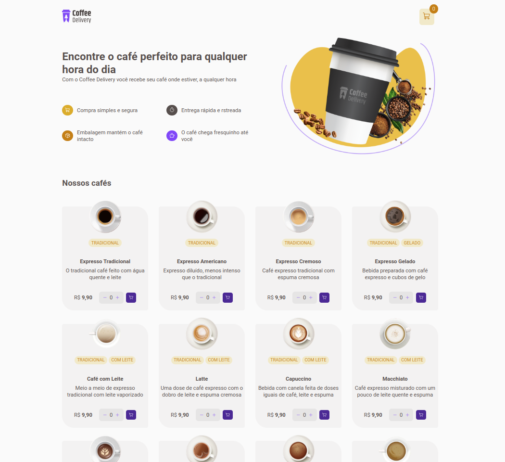

<h1 align="center">
  coffee-delivery
</h1>

  

 

##  Projeto

Desafio 02 do Bootcamp Ignite da Rocketseat.

## ✨ Tecnologias

Esse projeto foi desenvolvido com as seguintes tecnologias:

- [ReactJS](https://reactjs.org/)
- [TypeScript](https://www.typescriptlang.org/)
- [Styled-Components](https://styled-components.com/)
- [Zod](https://zod.dev/)

## Conceitos

 - Manipulação de rotas, com React Router DOM
 - Validação de formulários com Zod
 - Context API, para implementação do carrinho de compras
 - Reducers, para padronizar as operações do carrinho de compras

## Utilização do projeto

### 💾 Baixar o projeto
Faça o clone do repositório para ter uma versão do projeto em sua máquina: 
`$ git clone https://github.com/ViniciusPrataKloh/coffee-delivery.git
.git`

### 🧰 Instalar dependências
`$ npm install`  

### 🚀 Iniciar o projeto
`$ npm run dev`
 

